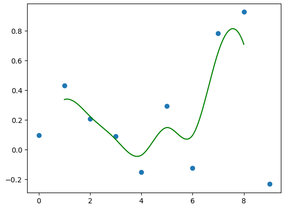

# ComputerAnimation
Code from my computer animation class. All code in Python.

 
<b>HW 1: Splines</b> 
Bezier Curve  
B Spline 
Catmull Rom 
Comparison of all 

  
<b>HW 2: Integrator</b> 
Freefall gif  
  
Comparison of integrator methods  

  
<b>HW 3: Tinkertoy</b>  

  
<b>HW 4: Rigidbody</b>  

